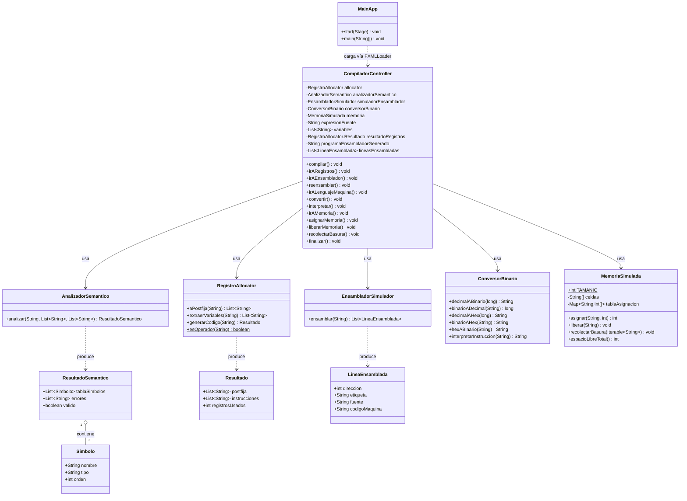

# Diagrama de clases — Compilador (con analizador semántico)

## Diagrama

## Documentación de cada clase

### `MainApp`
Punto de entrada de la aplicación JavaFX. Carga el único archivo
`compilador-view.fxml` con `FXMLLoader` y muestra la ventana principal.
No contiene lógica del compilador; solo arranca la interfaz.

### `CompiladorController`
Controlador único de toda la interfaz (`compilador-view.fxml`). Es quien
orquesta el flujo del compilador: recibe la expresión fuente, invoca en
orden al analizador semántico, al asignador de registros, al simulador
de ensamblador, al conversor binario y al simulador de memoria, y va
mostrando/ocultando el panel correspondiente a cada fase. Guarda como
atributos el resultado de cada fase para pasarlo a la siguiente
(la expresión original, las variables detectadas, el resultado de
registros, el programa ensamblador generado y las líneas ya ensambladas).

### `AnalizadorSemantico` (paquete `semantico`)
Implementa el **análisis semántico** del compilador, la fase que se
pidió documentar con su propio diagrama de clases:
- Construye la **tabla de símbolos** (clase `Simbolo`): cada variable
  detectada en la expresión, con un tipo inferido (`"entero"`, ya que
  el lenguaje solo maneja expresiones numéricas) y su orden de aparición.
- Valida reglas semánticas que la gramática por sí sola no puede
  detectar: identificadores inválidos, división entre el literal `0`,
  operadores consecutivos sin sentido y paréntesis no balanceados.
- Devuelve un `ResultadoSemantico` con la tabla de símbolos, la lista de
  errores encontrados y una bandera `valido`. Si `valido` es falso, el
  compilador no permite avanzar a la generación de código.

### `RegistroAllocator` (paquete `registros`, 4.1)
Convierte la expresión infija a notación postfija y simula la
asignación de registros del CPU, reutilizándolos cuando ya no se
necesitan (clase `Resultado`).

### `EnsambladorSimulador` (paquete `ensamblador`, 4.2)
Traduce un pequeño programa en un ensamblador simbólico a "código
máquina" hexadecimal, resolviendo las referencias simbólicas
(etiquetas) automáticamente (clase `LineaEnsamblada`).

### `ConversorBinario` (paquete `lenguajemaquina`, 4.3)
Convierte valores entre decimal, binario y hexadecimal, e interpreta
una instrucción binaria de 8 bits en su opcode y operando.

### `MemoriaSimulada` (paquete `memoria`, 4.4)
Simula la memoria principal como un arreglo lineal de localidades de un
byte, con asignación tipo *first-fit*, liberación manual y un
recolector de basura simplificado.

## Notas sobre el diagrama

- Las flechas punteadas (`..>`) representan dependencia ("usa" o
  "produce una instancia de"); las flechas continuas (`-->`) representan
  asociación ("tiene una referencia permanente a").
- `ResultadoSemantico` agrega (`o--`) una colección de `Simbolo`: la
  tabla de símbolos.
- El diagrama se puede visualizar con cualquier editor compatible con
  Mermaid (por ejemplo, la vista previa de Markdown de IntelliJ con el
  plugin de Mermaid, o https://mermaid.live pegando el bloque de código).
